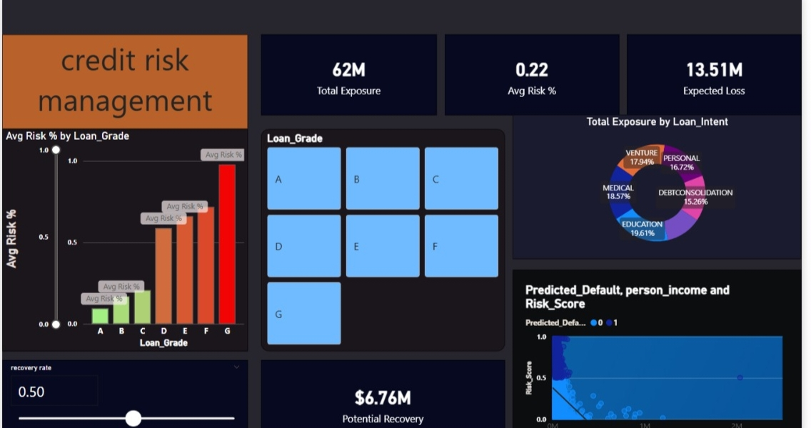

# 📊 Credit Risk Management Dashboard

## 1. Project Title / Headline
**Credit Risk Management Dashboard**
A sophisticated data analytics and visualization tool designed to evaluate borrower reliability, monitor loan portfolios, and mitigate financial risk through real-time data insights.

---

## 2. Short Description / Purpose
The Credit Risk Management Dashboard is an interactive Power BI report developed to provide financial institutions with a high-level view of their credit exposure. It enables risk officers and stakeholders to track default probabilities, assess creditworthiness across different segments, and identify high-risk accounts before they impact the bottom line.

---

## 3. Tech Stack
The dashboard was built using the following tools and technologies:

* **📊 Power BI Desktop** – Core platform used for data visualization and report design.
* **📂 Power Query** – Utilized for ETL (Extract, Transform, Load) processes to clean and structure financial datasets.
* **🧠 DAX (Data Analysis Expressions)** – Used to create complex measures like Expected Loss (EL), Probability of Default (PD), and Risk-Weighted Assets.
* **📝 Data Modeling** – Structured a star schema to connect borrower demographics, payment history, and loan details.

---

## 4. Data Source
* **Source:** Synthetic/Internal Financial Credit Dataset.
* **Data Structure:** Includes borrower information (income, credit score, age), loan attributes (amount, interest rate, term), and repayment status (past due, current, defaulted).

---

## 5. Features / Highlights

### Business Problem
Financial institutions face significant losses when they cannot accurately predict which borrowers are likely to default. Static reports often fail to capture the dynamic nature of credit risk across different industries and geographical regions.

### Goal of the Dashboard
* To visualize the health of the entire loan portfolio at a glance.
* To provide granular filtering for deep-dive analysis into high-risk segments.
* To assist in **Software Project Management (SPM)** decision-making regarding credit policy adjustments.

### Walkthrough of Key Visuals
1. **Risk Rating Distribution:** A bar chart showing the count of borrowers per risk grade (A-G).
2. **Default Rate by Geography:** A map visualization highlighting regions with the highest delinquency rates.
3. **Portfolio Health:** Donut charts illustrating the ratio of Performing vs. Non-Performing Loans (NPL).
4. **Income vs. Loan Amount:** A scatter plot to identify outliers and over-leveraged borrowers.
5. **Trend Analysis:** Line charts showing the evolution of credit scores and default rates over several quarters.

### Business Impact & Insights
* **Proactive Mitigation:** Identifies "Early Warning Signals" for accounts moving toward delinquency.
* **Capital Allocation:** Helps in determining the necessary capital reserves based on portfolio risk levels.
* **Strategic Growth:** Points out low-risk segments where the institution can safely increase lending.

---

## 6. Screenshots / Demos

